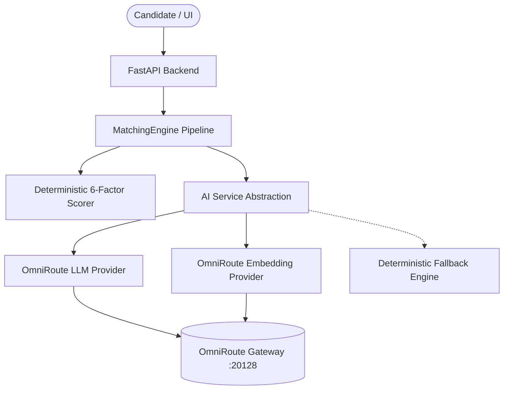

# Phase 4 — AI Job Matching Engine & OmniRoute AI Integration Documentation

## 1. Overview & Primary Objective
Phase 4 implements a production-grade, explainable **AI Job Matching Engine** integrated with the **OmniRoute AI Gateway**. The engine rigorously evaluates a candidate's structured profile, resume, preferences, and normalized job listings across 6 deterministic dimensions, semantic vector embeddings, and an independent eligibility matrix to produce actionable recommendations and natural-language explanations.

---

## 2. OmniRoute AI Gateway Architecture
OmniRoute acts as the unified, provider-agnostic AI Gateway using an OpenAI-compatible HTTP interface:
- **Base URL**: `http://localhost:20128/v1`
- **Endpoints Utilized**: `/chat/completions`, `/embeddings`, `/models`
- **Security**: The API key is securely loaded from environment variables (`OMNIROUTE_API_KEY`) on the backend only and never exposed to the frontend browser or logged in traces.



---

## 3. Environment Variables
Template provided in `.env.example` and `backend/.env.example`:

```bash
# OmniRoute AI Gateway
OMNIROUTE_BASE_URL=http://localhost:20128/v1
OMNIROUTE_API_KEY=
OMNIROUTE_CHAT_MODEL=gpt-4o
OMNIROUTE_EMBEDDING_MODEL=text-embedding-3-small
OMNIROUTE_TIMEOUT_SECONDS=60
OMNIROUTE_MAX_RETRIES=3

DEFAULT_AI_PROVIDER=omniroute

# Matching Engine Configurable Weights (Must sum to 100)
MATCH_SKILLS_WEIGHT=35
MATCH_EXPERIENCE_WEIGHT=20
MATCH_EDUCATION_WEIGHT=15
MATCH_LOCATION_WEIGHT=10
MATCH_ROLE_WEIGHT=10
MATCH_SALARY_WEIGHT=10

# Matching Engine Recommendation Thresholds
MATCH_STRONG_THRESHOLD=90
MATCH_GOOD_THRESHOLD=80
MATCH_POSSIBLE_THRESHOLD=70
MATCH_WEAK_THRESHOLD=60
```

---

## 4. AI Abstraction Layer (`backend/app/ai/`)
- `LLMProvider` (`backend/app/ai/interfaces/llm_provider.py`): Abstract interface for `generate_text()`, `generate_structured()`, and `check_health()`.
- `EmbeddingProvider` (`backend/app/ai/interfaces/embedding_provider.py`): Abstract interface for `generate_embedding()`.
- `OmniRouteLLMProvider` & `OmniRouteEmbeddingProvider` (`backend/app/ai/providers/omniroute.py`): OpenAI-compatible HTTP client with retries and exponential backoff.
- `MockLLMProvider` & `MockEmbeddingProvider` (`backend/app/ai/providers/mock.py`): Deterministic local test providers supporting error simulation (timeout, 401, 429, 500, malformed JSON).
- `AIService` (`backend/app/ai/services/ai_service.py`): Coordinates text generation, structured JSON validation with Pydantic, prompt injection sanitization, and fallback.
- `EmbeddingService` (`backend/app/ai/services/embedding_service.py`): Generates vector embeddings with SHA-256 caching and cosine similarity calculation.

---

## 5. Deterministic 6-Factor Scoring
The engine aggregates scores deterministically without LLM hallucination:

$$\text{Overall Score} = \sum_{i=1}^{6} (\text{Dimension Score}_i \times \text{Weight}_i)$$

| Dimension | Default Weight | Key Rules & Matcher Logic |
|---|---|---|
| **Technical Skills** | 35% | Canonical alias normalization (e.g. `JS` $\rightarrow$ `JavaScript`, `Postgres` $\rightarrow$ `PostgreSQL`). Required skills weighted at 75%, preferred at 25%. Strong penalty for missing required skills. |
| **Experience Seniority** | 20% | Correctly treats freshers ($0$ years) applying to entry-level ($0-2$ years) roles as $100\%$ ELIGIBLE without penalization. Evaluates seniority bounds. |
| **Education & Degree** | 15% | Accredited hierarchy evaluation with degree equivalence matching (B.Tech $=$ B.E. $=$ B.S. in Computer Science/IT/Software Engineering). |
| **Location & Remote** | 10% | Remote/Hybrid alignment, geographical constraints (flags national work authorization boundaries). |
| **Role Alignment** | 10% | Target titles vs job title cluster alignment (Software Engineer $\approx$ SDE $\approx$ Backend Developer $\ne$ Graphic Designer). |
| **Salary Expectations** | 10% | Multi-currency and LPA normalization. Marked `salary_information_available=false` if undisclosed without inflating to $100\%$. |

---

## 6. Recommendation & Eligibility Matrix
- **Recommendation Status**:
  - $90 - 100\%$: `STRONG_MATCH`
  - $80 - 89\%$: `GOOD_MATCH`
  - $70 - 79\%$: `POSSIBLE_MATCH`
  - $60 - 69\%$: `WEAK_MATCH`
  - $0 - 59\%$: `NOT_RECOMMENDED`
- **Eligibility Status**:
  - `ELIGIBLE`: Satisfies all mandatory criteria.
  - `LIKELY_ELIGIBLE`: Satisfies core requirements with minor non-blocking gaps.
  - `REVIEW`: Boundary conditions or unverified location constraints.
  - `NOT_ELIGIBLE`: Violates hard prerequisite (e.g., US citizenship requirement for foreign resident, or missing mandatory qualifications).
  - `INSUFFICIENT_DATA`: Missing candidate profile or job description.

---

## 7. Security & Prompt Injection Defense
- Untrusted external job descriptions pass through `AIService.sanitize_untrusted_input()` which neutralizes prompt-injection attacks attempting to override developer instructions or leak user data.
- User data minimization: Only minimal matching context (scores, matched/missing skill names) is transmitted to the AI provider.

---

## 8. Failure Handling & Offline Resilience
If OmniRoute is unconfigured, unreachable, or returns an error:
1. Safe technical logging without exposing API credentials.
2. The system seamlessly falls back to 100% deterministic matching.
3. Deterministic template explanations are generated.
4. The user interface remains responsive and transparent with live health status badges.

---

## 9. REST API Endpoints
All endpoints are authenticated and user-scoped:
- `GET /api/v1/matching/health` — Safe OmniRoute & matching engine health check.
- `POST /api/v1/matching/jobs/{job_id}` — Evaluate candidate profile against a job.
- `POST /api/v1/matching/batch` — Batch evaluate multiple jobs.
- `GET /api/v1/matching/jobs/{job_id}` — Retrieve calculated job match.
- `GET /api/v1/matching/recommended` — Get recommended jobs sorted by match score with filters (`minimum_score`, `eligibility`, `recommendation`).
- `GET /api/v1/matching/matches` — Get full match history.
- `POST /api/v1/matching/jobs/{job_id}/bookmark` — Toggle match bookmark.

---

## 10. Test Verification
All 61 unit and integration tests pass in pytest:
```bash
python -m pytest tests/
```
Covering all 40 required test scenarios including perfect match, edge cases, entry-level freshers, degree equivalences, OmniRoute timeouts, authentication errors, batch matching, prompt injection resilience, and unauthorized access protection.
